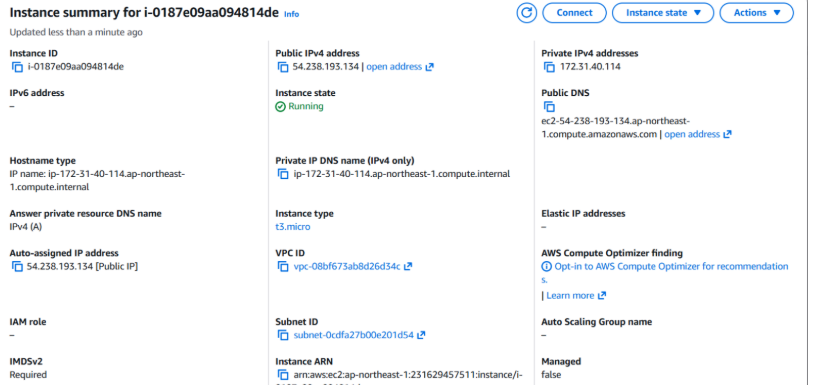
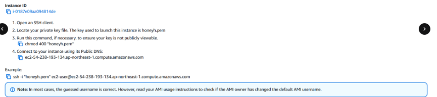
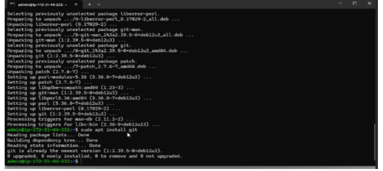

# AWS Honeypot Deployment

## Objective

This project involved deploying and configuring a honeypot on an Amazon AWS EC2 instance to simulate a vulnerable target system. The goal was to improve threat detection capabilities and support proactive security monitoring in a controlled cloud environment.

---

## Tools & Technologies

| Tool | Purpose |
|---|---|
| Amazon AWS EC2 | Cloud instance hosting the honeypot |
| Linux (Ubuntu) | Server operating system |
| SSH Key Authentication | Secure remote access management |
| Honeypot Software | Simulated attack surface for threat capture |

---

## What I Did

- Deployed and configured a honeypot on an AWS EC2 instance to simulate a target system and attract potential attackers
- Managed the Linux-based server remotely through SSH key authentication, eliminating password-based vulnerabilities
- Monitored incoming traffic and logged suspicious activity to analyze attacker behavior in a controlled environment
- Strengthened cloud instance security by hardening system configurations and restricting unnecessary access points

---

## Screenshots

### EC2 Instance Running

### SSH Connection Setup

### Linux Terminal — Package Configuration

---

## Skills Demonstrated

- Cloud infrastructure deployment (AWS EC2)
- Linux server administration and hardening
- SSH key-based authentication configuration
- Threat detection and proactive security monitoring
- Cloud security best practices

---

## Outcome

Successfully stood up a functional honeypot environment in AWS that captured and logged simulated threat activity, demonstrating hands-on cloud security and Linux server management skills.
